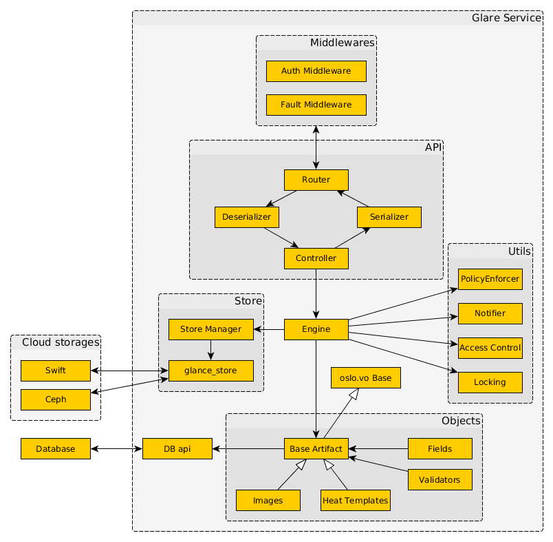

..
      Copyright 2017 - Nokia Networks
      All Rights Reserved.

      Licensed under the Apache License, Version 2.0 (the "License"); you may
      not use this file except in compliance with the License. You may obtain
      a copy of the License at

          http://www.apache.org/licenses/LICENSE-2.0

      Unless required by applicable law or agreed to in writing, software
      distributed under the License is distributed on an "AS IS" BASIS, WITHOUT
      WARRANTIES OR CONDITIONS OF ANY KIND, either express or implied. See the
      License for the specific language governing permissions and limitations
      under the License.

==================
Basic architecture
==================

OpenStack Glare has a client-server architecture that provides a Unified REST API,
which then transfers control to the appropriate artifact type. The API consists of
 * *Router*, that converts WSGI requests into appropriate Glare API methods;
 * *Deserializer*, that parses parameters from user input and performs initial
   validation checks;
 * *Controller*, which is responsible for interactions with Glare Engine;
 * *Serializer*, that prepares information for responses (inserts status code,
   content-type, response content length, and so on).

But before the requests reach the API they have to pass trough the set of
middlewares, and each performs some actions over Request or Response objects.
For example, *Auth* middleware checks that authentication token provided in request
header is valid by sending auth requests to Identity service, obtains user
information and injects it in Request object as a context objects;
*Fault middleware*, on the other hand, is responsible for converting inner
Glare exceptions to appropriate http error codes.

Almost all business logic is provided by Glare *Engine*. It is responsible
for *Policy* checking, when operator may define what operations users may execute,
based on their contexts; for sending broadcast *Notifications* about performed
actions; then it is *Access Control*, when Engine checks if user has rights to
modify desired artifact; and finally – *Locking*, that is used to prevent race
conditions during artifact updates, when the artifact is locked until the
modification operation is finished.

All the file (Blob data) operations are performed using
*glance_store* library, which is responsible for interaction with external
storage back ends and (or) local filesystem(s). The glance_store library
provides a uniform interface to access the backend stores. Also there is
an adapter layer *Store Manager* between Engine and glance_store that is
responsible for converting glance_store exceptions and adding some additional
logic, like sha256 calculation.

All database operations are organized with artifact types. Each type installed
in the system must implement Glare Artifact Type Interface (GATI) and use
appropriate data types to describe its attributes.

Glare uses several data types from a declarative framework *oslo.versionedobjects*:
Integer, Float, String, Boolean, which complemented with the following home-grown
data types:
 * Version — specifies the version of the artifact in ‘SemVer’ format and
   implements comparison operations.
 * Dependency — sets a reference to another artifact. At the request of the
   ‘dependency’ field, Glare will get the dependent artifact meta-information.
 * Blob — specifies a binary object. When a user assigns a value to this field,
   data will be automatically redirected to one of the connected storages.
 * List and Dict — define complex data structures such as Lists and Dictionaries
   of primitive types respectively.

*Base artifact type* is an abstract  class that has a reference implementation
of GATI. It contains only common fields, like "id", "name", "version",
"created_at”, "owner", and so on.

Each artifact type is inherited from the Base and adds some additional fields.
For example, for Image artifact type there were added "container_format" and
"disk_format" string fields, for Heat Template it was "nested_templates" Blob
Dictionary.

*Validators* are objects that can be attached to a filed to perform additional
checks. For example, if validator MinLen(1) is attached to a string field it
checks that the string value is non empty. Validator ForbiddenChars("/", ",")
validates that there shouldn't be slashes and commas in the string.

Glare uses a central *Database* that is shared amongst all
the components in the system and is sql-based by default. Other types
of database backends are somewhat supported and used by operators
but are not extensively tested upstream.

.. centered:: Image 1. OpenStack Glare Architecture
